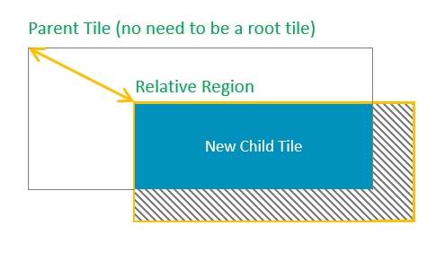
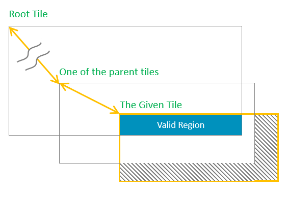
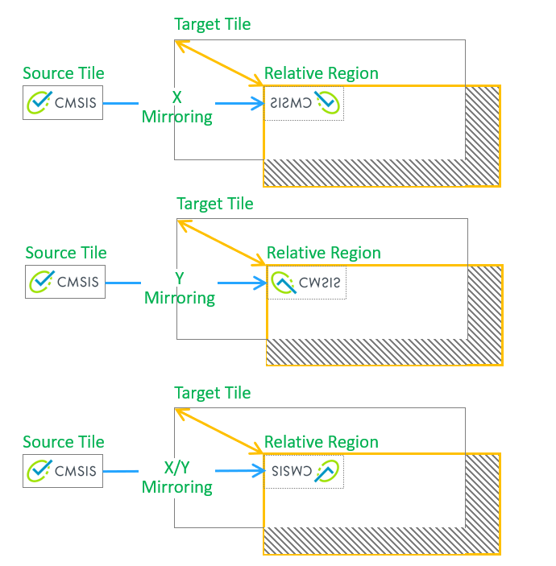
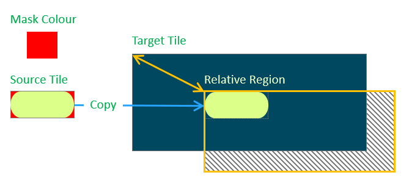

# How to Use Tile Operations


## 1 Overview

The Tile Operation is the most fundamental API category of the Arm-2d. It consists of three sub-categories:

- Basic: for tile creation, editing and maintenance
  - **Generate a child tile** based on a specified tile and a region within the target tile. 
  - **Get the root tile** of a given one.
  - **Check** whether a given tile is a **root tile** or not
  - **Intersect two given regions** and generate a clipped region.
- Tile Copy
  - **Copy** a source tile to a target tile with specified region within the target tile
  - **Fill** a target tile with a specified source tile
- Tile Copy with transparency colour, i.e. **colour masking**
  - Copy a source tile to a target tile with a given region inside the target tile, and during this process, once a specified colour is read from the source tile, the foreground pixel will be ignored. This is very useful to render non-rectangular visual elements. 
- Implement Partial Framebuffer support
  - By drawing the same content several times, it is possible to flush a complete frame to a big screen (with arbitrary resolution)  using just a fraction of the frame buffer. This time-space exchanging scheme is called Partial Frame Buffer (PFB). **While using PFB in the low level, the GUI built upon Arm-2d APIs can generally act as a full-frame buffer is used**.

All related definitions are listed in the interface header file ***Arm_2d_tile.h*** and the default C implementation and Helium implementation can be found in ***Arm_2d_tile.c***. 


## 2 Key Scenarios, Patterns and Use Cases 

### 2.1 Normal Usage

A Root tile is a kind of tiles that directly contain the display buffer, and its feature bit ***bIsRoot*** is set, according to the pixel types used in the display buffer to which corresponding pointers should be used. 

It is worth emphasizing that for a root Tile, its Location coordinate must be ***(0,0)***; otherwise, it is considered illegal.

With the help of [C99 designator](https://gcc.gnu.org/onlinedocs/gcc/Designated-Inits.html), a tile structure can be initialised clearly and easily. The following example shows a root tile ***c_tPictureCMSISLogo*** representing a ***RGBA8888*** bitmap stored in a constant array called ***c_bmpCMSISLogo[]***. Note that because the bitmap and the tile structure are designated as constants, it is highly likely that a compiler will use ROM rather than RAM to store them and keep a small RAM footprint. 

```c
/*! picture cmsis_logo */
extern const uint8_t c_bmpCMSISLogo[163 * 65 * sizeof(uint32_t)];
const static arm_2d_tile_t c_tPictureCMSISLogo = {
    .tRegion = {
        .tSize = {
            .iWidth = 163,
            .iHeight = 65
        },
    },
    .tInfo = {
        .bIsRoot = true,
        .bHasEnforcedColour = true,
        .tColourInfo = {
            .chScheme = ARM_2D_COLOUR_RGBA8888,
        },
    },
    .pwBuffer = (uint32_t *)c_bmpCMSISLogo,
};
```

In fact, with the help of some macros, we can use Tile to implement the concept of the so-called visual layer:

```c
#define __declare_tile(__NAME)                                      \
            extern const arm_2d_tile_t __NAME;
#define declare_tile(__NAME)            __declare_tile(__NAME)

#define __implement_tile(__NAME, __WIDTH, __HEIGHT, __TYPE)         \
            ARM_NOINIT static __TYPE                                \
                __NAME##Buffer[(__WIDTH) * (__HEIGHT)];             \
            const arm_2d_tile_t __NAME = {                          \
                .tRegion = {                                        \
                    .tSize = {(__WIDTH), (__HEIGHT)},               \
                },                                                  \
                .tInfo.bIsRoot = true,                              \
                .pchBuffer = (uint8_t *)__NAME##Buffer,             \
            }
            
#define implement_tile(__NAME, __WIDTH, __HEIGHT, __TYPE)           \
            __implement_tile(__NAME, __WIDTH, __HEIGHT, __TYPE)
```

For example, we can create two visual layers with size **100\*100** and ***200\*50*** respectively and using colour ***arm_2d_color_rgb565_t*** for pixels:

```c
declare_tile(c_tLayerA)
implement_tile(c_tLayerA, 100, 100, arm_2d_color_rgb565_t);

declare_tile(c_tLayerB)
implement_tile(c_tLayerB, 200, 50, arm_2d_color_rgb565_t);
```

These layers are stored in RAM, which are used as sources and targets for 2D operations. 

Note that in the aforementioned macro template, we use ***ARM\_NOINIT*** to decorate the display buffer, its definition is shown below:

```c
#ifndef ARM_NOINIT
#if     defined(__IS_COMPILER_ARM_COMPILER_5__)
#   define ARM_NOINIT           __attribute__( ( section( ".bss.noinit"),zero_init) )
#elif   defined(__IS_COMPILER_ARM_COMPILER_6__)
#   define ARM_NOINIT           __attribute__( ( section( ".bss.noinit")) )
#elif   defined(__IS_COMPILER_IAR__)
#   define ARM_NOINIT           __no_init
#elif   defined(__IS_COMPILER_GCC__) || defined(__IS_COMPILER_LLVM__)
#   define ARM_NOINIT           __attribute__(( __section__( ".bss.noinit")))
#else
#   define ARM_NOINIT
#endif
#endif
```

It is clear that for the Arm Compiler 5 and Arm Compiler 6, ***ARM_NOINIT*** puts the target variable into a ***ZI*** section called ***".bss.noinit"*** which later should be placed in an execution region with ***[UNINIT](https://developer.arm.com/documentation/101754/0616/armlink-Reference/Scatter-File-Syntax/Execution-region-descriptions/Execution-region-attributes)*** feature in a scatter-script, for example:

```
LR_ROM __ROM_BASE __ROM_SIZE  {                           
    ...

    ARM_LIB_STACK __RAM1_BASE ALIGN 8 EMPTY __STACK_SIZE { ; Reserve empty region for stack
    }

    RW_RAM1 +0 __RAM1_RW_SIZE {
        * (+RO-DATA)
        * (+RW +ZI)
    }

    RM_RAM_NOINIT +0 UNINIT {
        * (.bss.noinit)
    }

    ARM_LIB_HEAP  __HEAP_BASE ALIGN 8 EMPTY __HEAP_SIZE  { ; Reserve empty region for heap
    }
    ...
}
```


#### 2.1.1 Window/Panel Clipping

**All operations in Arm-2D support region clipping by default**, which means users don't have to handle window/panel clipping manually. In rare cases where users have to intersect regions and/or tiles, Arm-2D provides dedicated APIs to facilitate such operations. 

For more details, please refer to **section 4.1**.


#### 2.1.2 Texture Paving

Paving Texture on a target display buffer is one of the most commonly used 2D operations. Arm-2D supports this with tile copy APIs, in which a copy mode can be specified, and **Arm_2D_CP_MODE_FILL** is used to enable the texture paving feature. 

For more details, please refer to **section 4.2**. 


### 2.2 Advanced Usage

#### 2.2.1 Partial Frame Buffer (PFB)

The so-called Partial Frame Buffer is a special use of the Tile Child scheme. It establishes a root Tile for a tiny rectangular display buffer and derives a Child Tile having the same size as the actual screen. In practice, the GUI software in the upper layer uses the Child Tile (with the full-screen size) to draw graphics and blend visual layers. After completing a frame, the PFB that actually saves the pixel information is sent to the LCD driver for a flush. Since FPB only covers a small area, the drawing process aforementioned, in most cases, will be judged as "no need for actual drawing" and skipped. To display the entire screen, we need to repeat this process continuously and adjust the relative Location between FPB and the Child Tile at the beginning of each iteration. For us, it looks like moving FPB line by line on the screen as shown in **Figure 2-4**.

**Figure 2-4 How Partial Frame Buffer Works**

 

More details are shown in a dedicated example project located in "***examples/partial_frame_buffer***" directory.


## 3 Design Considerations

Base on the feedbacks collected, design considerations will be documented in the future. 


## 4 API Table

### 4.1 Basic

#### 4.1.1 **arm_2d_tile_generate_child**

| Topic            | Content                                  | Description                                                  |
| :--------------- | ---------------------------------------- | ------------------------------------------------------------ |
| **Name**         | ***arm_2d_tile_generate_child***         | Type: function                                               |
| **Parameter**    | const arm_2d_tile_t * ***ptTargetTile*** | The address of the target parent tile                        |
| **Parameter**    | const arm_2d_region_t * ***ptRegion***   | The relative region inside the target tile                   |
| **Parameter**    | arm_2d_tile_t * ***ptOutput***           | The address of the new child tile which user should provide. |
| **Parameter**    | bool ***bClipRegion***                   | Indicates whether clip the region of the new child.          |
| **Return Value** | (arm_2d_tile_t \*) ***non-null***        | The address of the new child tile which user provide.        |
| **Return Value** | ***NULL***                               | The relative region has no intersection point with the target tile |

The behaviour of function ***arm_2d_tile_generate_child()*** is illustrated in the **Figure 4.1**. This function will generate a child from a target tile based on a given relative region inside the tile. The user has to provide a buffer for the child tile.  If there is no intersection between the tile region and the given relative region, i.e. the relative region is out of the tile region, NULL is returned; otherwise, the provided child tile address is returned. 

**Figure 4.1 How A Child Tile Is Generated From A Parent Tile**

 

#### 4.1.2 **arm_2d_tile_get_root**

| Topic            | Content                               | Description                                                  |
| ---------------- | ------------------------------------- | ------------------------------------------------------------ |
| **Name**         | ***arm_2d_tile_get_root***            | Type: function                                               |
| **Parameter**    | const arm_2d_tile_t * ***ptTile***    | a given tile                                                 |
| **Parameter**    | arm_2d_region_t * ***ptValidRegion*** | The address of a buffer used to store the valid region information |
| **Return Value** | (arm_2d_tile_t \*) ***non-null***     | The address of the root tile                                 |
| **Return Value** | ***NULL***                            | The given tile has no intersection with the root tile, i.e. the given tile is out of the region its root tile. |

The behaviour of function ***arm_2d_tile_get_root()*** is illustrated in **Figure 4.2**. This function firstly uses the region of a given tile as the initial value of the valid region and repeats the following steps:

1. Check if current tile is a root tile or not, if so, return the address of current tile.
2. Update the relative coordinates based on the relative location of current tile
3. intersect the valid region with current region. If there is no intersection point, return NULL.
4. Get the parent tile and repeat from step 1


**Figure 4.2 How A Root Tile Is Retrieved**

 

**NOTE:** Even if a tile appears inside the root tile, but there could be a string of parents between the target tile and the root, as long as the tile is out of the region of any one of the parents, it is still considered as out of region. 


#### 4.1.3 **arm_2d_is_root_tile**

| Topic            | Content                            | Description                                                  |
| ---------------- | ---------------------------------- | ------------------------------------------------------------ |
| **Name**         | ***arm_2d_is_root_tile***          | Type: static inline function                                 |
| **Parameter**    | const arm_2d_tile_t * ***ptTile*** | The target tile                                              |
| **Return Value** | ***true***                         | The tile is a root tile, i.e. it contains a display buffer   |
| **Return Value** | ***false***                        | The tile is a child tile, i.e. it has a pointer for a parent tile. |

This function is used to test whether a given tile is a root one or not.


#### 4.1.4 **arm_2d_region_intersect**

| Topic            | Content                                   | Description                                                  |
| ---------------- | ----------------------------------------- | ------------------------------------------------------------ |
| **Name**         | ***arm_2d_region_intersect***             | Type: function                                               |
| **Parameter**    | const arm_2d_region_t * ***ptRegionIn0*** | The address of the input region 0                            |
| **Parameter**    | const arm_2d_region_t * ***ptRegionIn1*** | The address of the input region 1                            |
| **Parameter**    | arm_2d_region_t * ***ptRegionOut***       | The buffer of the output region, this address **CAN** be NULL. |
| **Return Value** | ***true***                                | The given two input regions have a overlapping region which is stored in a specified buffer. |
| **Return Value** | ***false***                               | The given two input regions have no intersection point.      |

The behaviour of function **arm_2d_region_intersect** is illustrated in **Figure 4.3**. This function tries to intersect two input regions and output the overlapping area in a user-specified buffer. A Boolean value is returned to indicate that whether two input regions overlap with each other or not. If false is returned, the content in the output buffer is not valid. 

**NOTE**: If you only want to check whether two regions overlap with each other or not, you can omit the region output buffer and use NULL instead.

**Figure 4.3 How Region Intersection/Clipping Works**

 


#### 4.1.5 **arm_2d_get_address_and_region_from_tile**

| Topic         | Content                                       | Description                                                  |
| ------------- | --------------------------------------------- | ------------------------------------------------------------ |
| **Name**      | ***arm_2d_get_address_and_region_from_tile*** | Type: function-like-macro                                    |
| **Parameter** | ***\_\_TILE\_PTR***                           | A pointer which points to the start address of the target tile. This macro will update this pointer with the root tile address. |
| **Parameter** | ***\_\_VALID\_REGION\_NAME***                 | The name of the region which will be defined by this macro   |
| **Parameter** | ***\_\_LOCATION\_OFFSET\_PTR***               | The address of a region which is used to store the relative location of the valid region inside the target tile. |
| **Parameter** | ***\_\_TYPE***                                | The type of the display buffer                               |
| **Parameter** | ***\_\_BUF\_PTR\_NAME***                      | The name of the pointer variable which will be defined by this macro |

With a given tile, this function-like-macro declare local variables to store the tile region and the start address of the display buffer. 

**NOTE**: 

1. When calling this macro, a ***pointer variable*** must be passed as the ***\_\_TILE\_PTR*** rather than a constant address of the target tile. It is because the macro calls ***arm_2d_tile_get_root()*** and uses its return value to update the pointer represented by ***\_\_TILE\_PTR***. 
2. Both ***\_\_REGION\_NAME*** and ***\_\_BUF\_PTR*** **MUST** be the names of two local variables, which will be declared by this macro. After calling the macro, those local variables will hold the information described in the table above and used by following code within the same braces. 


### 4.2 Copy, Fill and X/Y Mirroring

Tile Copy and Fill operations are **mutually exclusive** from each other. Their behaviours are illustrated in **Figure 4.4**. 

- For normal Tile Copy operations, the function tries to copy a given source tile to a relative region inside a target tile. Since there is no colour calculation involved, both the 16bit and the 32bit version functions can handle all the colour formats with the same data width. 
- For normal Tile Fill operations, the function tries to fill a given region inside the target tile with the source tile. Since there is no colour calculation involved, both the 16bit and the 32bit version functions can handle all the colour formats with the same data width. 

**Figure 4.4 How Tile Copy and Fill Works**

 

In addition to the standard Copy and Fill, operations can be combined with X and/or Y mirroring of the source tile (as shown in **Figure 4.5**). Those combinations together with the standard Copy and Fill are called copy modes. All the legitimate modes are listed in the table below. 

**Figure 4.5 How Copy with X/Y Mirroring Works**

 


| Mode                                                         | Description                                          | NOTE                                                         |
| ------------------------------------------------------------ | ---------------------------------------------------- | ------------------------------------------------------------ |
| **Arm_2D_CP_MODE_COPY**                                      | Copy the source tile to the target tile              |                                                              |
| **Arm_2D_CP_MODE_FILL**                                      | Fill a target tile with a given source tile          |                                                              |
| **Arm_2D_CP_MODE_COPY** \|<br />**Arm_2D_CP_MODE_X_MIRROR**  | Copy the X-mirrored source tile to the target tile   | **Arm_2D_CP_MODE_COPY** can be ignored                       |
| **Arm_2D_CP_MODE_COPY** \|<br />**Arm_2D_CP_MODE_Y_MIRROR**  | Copy the Y-mirrored source tile to the target tile   | **Arm_2D_CP_MODE_COPY** can be ignored                       |
| **Arm_2D_CP_MODE_COPY** \|<br />**Arm_2D_CP_MODE_X_MIRROR** \|<br />**Arm_2D_CP_MODE_Y_MIRROR** | Copy the X/Y-mirrored source tile to the target tile | **Arm_2D_CP_MODE_COPY** can be ignored                       |
| **Arm_2D_CP_MODE_FILL** \|<br />**Arm_2D_CP_MODE_X_MIRROR**  | Fill a target tile with a X-mirrored source tile     | **Not recommended** unless aided by hardware accelerator, see note. |
| **Arm_2D_CP_MODE_FILL** \|<br />**Arm_2D_CP_MODE_Y_MIRROR**  | Fill a target tile with a Y-mirrored source tile     | **Not recommended** unless aided by hardware accelerator, see note. |
| **Arm_2D_CP_MODE_FILL** \|<br />**Arm_2D_CP_MODE_X_MIRROR** \|<br /> **Arm_2D_CP_MODE_Y_MIRROR** | Fill a target tile with a X/Y-mirrored source tile   | **Not recommended** unless aided by hardware accelerator, see note. |

**NOTE**: For all the modes which combine Mirroring with Fill, as they might repeat the mirroring work unnecessarily,  cycles are wasted unless a hardware accelerator directly supporting those modes are used. If your GUI follows the **hardware-agnostic principle**, a better alternative would be **1) doing mirroring work once** and **2) fill the target tile with the mirrored one**.  


#### 4.2.1 **arm_2d_rgb16_tile_copy**

| Topic            | Content                                | Description                                                  |
| ---------------- | -------------------------------------- | ------------------------------------------------------------ |
| **Name**         | ***arm_2d_rgb16_tile_copy***           | Type: function                                               |
| **Parameter**    | const arm_2d_tile_t * ***ptSource***   | The source tile address                                      |
| **Parameter**    | const arm_2d_tile_t * ***ptTarget***   | The target tile address                                      |
| **Parameter**    | const arm_2d_region_t * ***ptRegion*** | The relative region inside the target tile                   |
| **Parameter**    | uint32_t ***wMode***                   | The mode of the copy, please refer to the copy mode description for more details. |
| **Return Value** | < 0 or ***arm_fsm_rt_err*** (-1)       | Error code                                                   |
| **Return Value** | ***arm_fsm_rt_cpl*** (0)               | Operation **completed**                                      |
| **Return Value** | ***arm_fsm_rt_on_going*** (1)          | Operation is **on-going**, and you have to keep calling this function until other value is returned. <br />This usually means that the function is working/implemented in ***synchronous mode***. For more, please refer to [Introduction.md](./Introduction.md). |
| **Return Value** | ***arm_fsm_rt_asyn***(3)               | Operation request has been received; no error found so far. If you have registered your own ***2D-Operation-Complete-Handler*** (***arm_2d_evt_t***), you don't have to poll this function anymore; the operation result will be passed to you via the event handler; otherwise, you can poll this function until another value is returned.  This usually means that the function is working/implemented in **asynchronous mode**.  For more, please refer to [Introduction.md](./Introduction.md). |

The behaviour of function **arm_2d_rgb16_tile_copy** is illustrated in **Figure 4.4**. This function copies a source tile to a specified region inside the target tile or fills the specified region with a given source tile. Several combinations of modes are supported, e.g. copy with X mirroring and/or Y mirroring.

**NOTE**: This function treats all 16-bit colour formats equally, and **NO** alpha channel is used, even for RGB1555. 


#### 4.2.2 **arm_2d_rgb32_tile_copy**

| Topic            | Content                                | Description                                                  |
| ---------------- | -------------------------------------- | ------------------------------------------------------------ |
| **Name**         | ***arm_2d_rgb32_tile_copy***           | Type: function                                               |
| **Parameter**    | const arm_2d_tile_t * ***ptSource***   | The source tile address                                      |
| **Parameter**    | const arm_2d_tile_t * ***ptTarget***   | The target tile address                                      |
| **Parameter**    | const arm_2d_region_t * ***ptRegion*** | The relative region inside the target tile                   |
| **Parameter**    | uint32_t ***wMode***                   | The mode of the copy, please refer to the copy mode description for more details. |
| **Return Value** | < 0 or ***arm_fsm_rt_err*** (-1)       | Error code                                                   |
| **Return Value** | ***arm_fsm_rt_cpl*** (0)               | Operation **completed**                                      |
| **Return Value** | ***arm_fsm_rt_on_going*** (1)          | Operation is **on-going**, and you have to keep calling this function until another value is returned.  This usually means that the function is working/implemented in **synchronous mode**. For more, please refer to [Introduction.md](./Introduction.md). |
| **Return Value** | ***arm_fsm_rt_asyn***(3)               | Operation request has been received; no error found so far. If you have registered your own ***2D-Operation-Complete-Handler*** (***arm_2d_evt_t***), you don't have to poll this function anymore; the operation result will be passed to you via the event handler; otherwise, you can poll this function until another value is returned.  This usually means that the function is working/implemented in **asynchronous mode**.  For more, please refer to [Introduction.md](./Introduction.md). |

The behaviour of function **arm_2d_rgb32_tile_copy** is illustrated in **Figure 4.4**. This function copies a source tile to a specified region inside the target tile or fills the specified region with a given source tile. Several combinations of modes are supported, e.g. copy with X mirroring and/or Y mirroring.

**NOTE**: This function treats all 32-bit colour formats equally and **NO** alpha channel is used, even for RGB8888 or RGBA8888. 


### 4.3 Colour Masking

Colour-masking is a commonly used scheme to implement non-rectangular UI elements, such as round-corner windows/gadgets, floating logos/strings etc. Colour-masking is relatively simple when compared with the Alpha-Masking scheme provided in the Alpha-blending operation category, which usually requires an 8-bit masking tile that can cover the source tile completely, and each pixel inside the masking tile is used as the alpha channel during an operation. A dedicated masking tile, of course, takes more memory space than a simple masking-colour. As long as the desired visual area of the source tile contains no pixel in the masking colour, it is much cheaper and quicker to use Colour-masking rather than Alpha-masking. 

**Figure 4.6 How Copy-with-Colour-Masking Works**

 


#### 4.3.1 **arm_2d_rbg16_tile_copy_with_mask_colour**

| Topic            | Content                                       | Description                                                  |
| ---------------- | --------------------------------------------- | ------------------------------------------------------------ |
| **Name**         | ***arm_2d_rbg16_tile_copy_with_mask_colour*** | Type: function                                               |
| **Parameter**    | const arm_2d_tile_t * **ptSource**            | The source tile address                                      |
| **Parameter**    | const arm_2d_tile_t * **ptTarget**            | The target tile address                                      |
| **Parameter**    | const arm_2d_region_t * **ptRegion**          | The relative region inside the target tile                   |
| **Parameter**    | uint16_t **hwMaskColour**                     | The colour used to mask the unwanted part in the source tile |
| **Return Value** | < 0 or **arm_fsm_rt_err** (-1)                | Error code                                                   |
| **Return Value** | **arm_fsm_rt_cpl** (0)                        | Operation **completed**                                      |
| **Return Value** | **arm_fsm_rt_on_going** (1)                   | Operation is **on-going**, and you have to keep calling this function until another value is returned.  This usually means that the function is working/implemented in **synchronous mode**. For more, please refer to [Introduction.md](./Introduction.md). |
| **Return Value** | **arm_fsm_rt_asyn**(3)                        | Operation request has been received; no error found so far. If you have registered your own ***2D-Operation-Complete-Handler*** (***arm_2d_evt_t***), you don't have to poll this function anymore; the operation result will be passed to you via the event handler; otherwise, you can poll this function until another value is returned.  This usually means that the function is working/implemented in **asynchronous mode**.  For more, please refer to [Introduction.md](./Introduction.md). |

The behaviour of function **arm_2d_rbg16_tile_copy_with_mask_colour** is illustrated in **Figure 4.6**. This function copies a given source tile to a specified region inside a target tile, during this process, user can specify a colour as the masking colour. If the colour of the pixel read from the source tile is the masking colour, the copy operation for that pixel will be ignored, as the result, i.e. the pixel in the background will be used. This function is dedicated to all colour formats with 16-bit pixel.  

**NOTE**: Alpha channels are ignored even if they exist. If you want a version that takes alpha-channel into consideration, please check alpha-blending related APIs.


#### 4.3.2 **arm_2d_rbg32_tile_copy_with_mask_colour**

| Topic            | Content                                       | Description                                                  |
| ---------------- | --------------------------------------------- | ------------------------------------------------------------ |
| **Name**         | ***arm_2d_rbg32_tile_copy_with_mask_colour*** | Type: function                                               |
| **Parameter**    | const arm_2d_tile_t * ***ptSource***          | The source tile address                                      |
| **Parameter**    | const arm_2d_tile_t * ***ptTarget***          | The target tile address                                      |
| **Parameter**    | const arm_2d_region_t * ***ptRegion***        | The relative region inside the target tile                   |
| **Parameter**    | uint16_t ***hwMaskColour***                   | The colour used to mask the unwanted part in the source tile |
| **Return Value** | < 0 or ***arm_fsm_rt_err*** (-1)              | Error code                                                   |
| **Return Value** | ***arm_fsm_rt_cpl*** (0)                      | Operation **completed**                                      |
| **Return Value** | ***arm_fsm_rt_on_going*** (1)                 | Operation is **on-going**, and you have to keep calling this function until another value is returned.  This usually means that the function is working/implemented in **synchronous mode**. For more, please refer to [Introduction.md](./Introduction.md). |
| **Return Value** | ***arm_fsm_rt_asyn***(3)                      | Operation request has been received; no error found so far. If you have registered your own ***2D-Operation-Complete-Handler*** (***arm_2d_evt_t***), you don't have to poll this function anymore; the operation result will be passed to you via the event handler; otherwise, you can poll this function until another value is returned.  This usually means that the function is working/implemented in **asynchronous mode**.  For more, please refer to [Introduction.md](./Introduction.md). |

The behaviour of function **arm_2d_rbg32_tile_copy_with_mask_colour** is illustrated in **Figure 4.6**. This function copies a given source tile to a specified region inside a target tile. During this process, the user can specify a colour as the masking colour. If the colour of the pixel read from the source tile is the masking colour, the copy operation for that pixel will be ignored. As a result, i.e. the pixel in the background will be used. This function is dedicated to all colour formats with the 32-bit pixel. 

**NOTE**: Alpha channels are ignored even if they exist. If you want a version that takes alpha-channel into consideration, please check alpha-blending related APIs.


## 5 Reference

1. [Introduction to Arm-2D](./introduction.md)